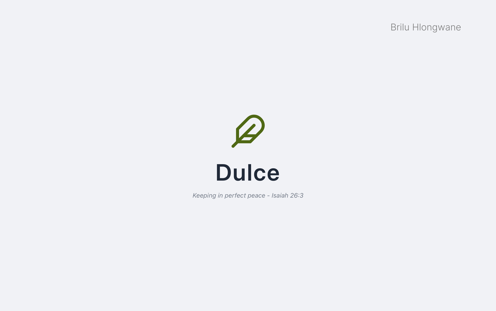
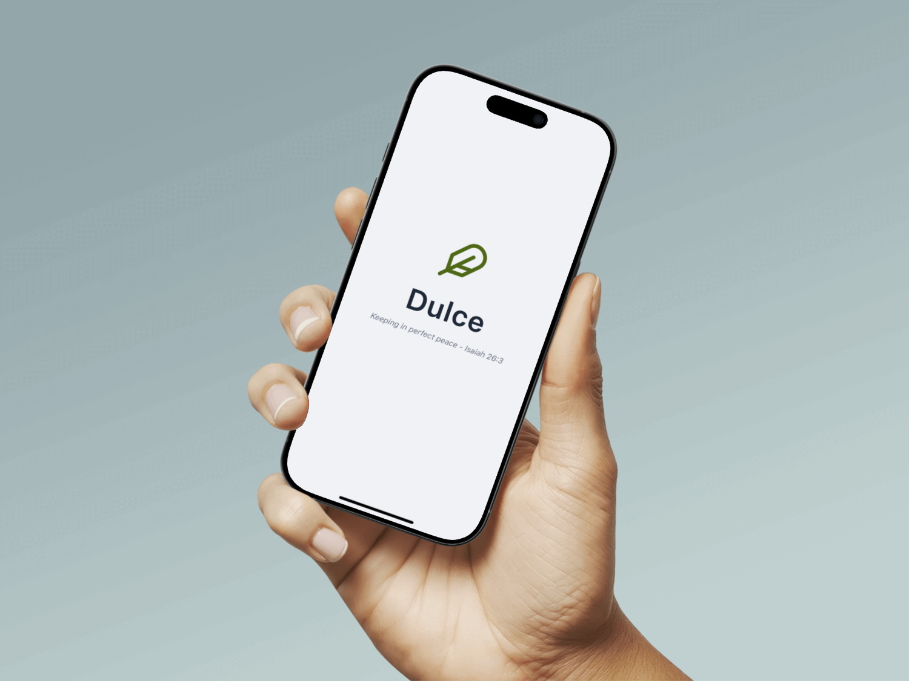
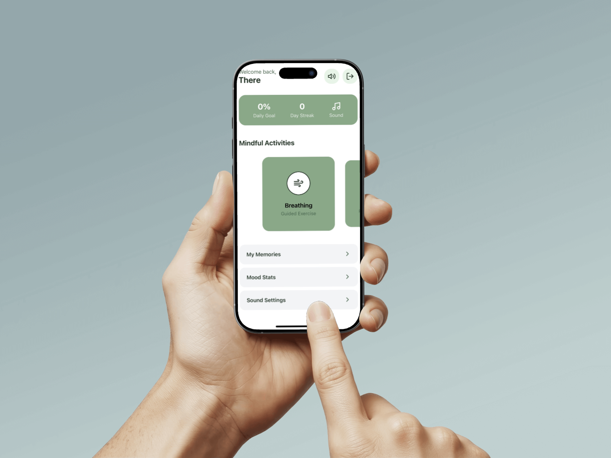

  

  <strong>A Mindful Wellness Companion for Calm and Focus</strong>

  
  
  
  

---

## 🌿 Core Philosophy

**Dulce** (pronounced _Dool-say_) is more than just an app; it's a digital sanctuary designed from the ground up to reduce stress through serene, gesture-based interactions. The core design principle is to replace complex UI with fluid, rhythmic gestures, creating a predictable and calming environment.

The application adheres to a strict "one-color" aesthetic, utilizing a deep **Olive Green (`#4E6813`)** and its tints to create a visually cohesive and low-sensory experience that is especially mindful of users on the autism spectrum.

## ✨ Key Features

  
<strong>🧠 Mindful Activities & Games</strong>

  <ul>
    <li><g-emoji class="g-emoji" alias="leaves">🍃</g-emoji> <strong>Guided Breathing:</strong> An interactive, timed breathing exercise with smooth animations.</li>
    <li><g-emoji class="g-emoji" alias="puzzle">🧩</g-emoji> <strong>Zen Slide & Starlight Tap:</strong> Non-verbal puzzle games designed to induce a state of flow.</li>
    <li><g-emoji class="g-emoji" alias="sparkles">✨</g-emoji> <strong>Willowisp Maze:</strong> A timed labyrinth with strategic elements to encourage focus.</li>
  </ul>

  
<strong>✍️ Personalized Journaling</strong>

  <ul>
    <li><g-emoji class="g-emoji" alias="notebook">📓</g-emoji> <strong>Text Journal:</strong> A private space for reflection with entries saved securely to Firestore.</li>
    <li><g-emoji class="g-emoji" alias="movie_camera">🎥</g-emoji> <strong>Video Diary:</strong> A non-verbal diary where users record and save short video clips via Cloudinary.</li>
  </ul>

  
<strong>📈 Progress & Motivation</strong>

  <ul>
    <li><g-emoji class="g-emoji" alias="fire">🔥</g-emoji> <strong>Daily Streaks & Progress Bar:</strong> Encourages daily engagement by tracking completed activities.</li>
    <li><g-emoji class="g-emoji" alias="bar_chart">📊</g-emoji> <strong>Mood Analytics:</strong> Visualizes mood trends over time with clean, modern charts.</li>
  </ul>

  
<strong>🎵 Immersive Experience</strong>

  <ul>
    <li><g-emoji class="g-emoji" alias="musical_note">🎵</g-emoji> <strong>Integrated Music Player:</strong> A playlist of calming background tracks with rotating album art, managed globally via React Context.</li>
    <li><g-emoji class="g-emoji" alias="art">🎨</g-emoji> <strong>Apple-Inspired "Soft UI":</strong> A clean, Neumorphic design with soft shadows and a polished aesthetic.</li>
  </ul>

## 🎨 Design Process & Mockups

The application's design was guided by high-fidelity mockups created in Figma. The goal was to establish a clean, calming, and modern aesthetic before implementation. The final app stays true to this initial vision, translating the design concepts into a fully functional user interface.

|                                          Splash Screen                                           |                                      Home Screen                                      |
| :----------------------------------------------------------------------------------------------: | :-----------------------------------------------------------------------------------: |
|  |  |

_**Note:** Replace `mockup-auth.png` and `mockup-home.png` with the actual filenames of your mockup images inside the `branding` folder._

## 🚀 Tech Stack

| Category                 | Technology                                        |
| :----------------------- | :------------------------------------------------ |
| **Framework**            | React Native with Expo                            |
| **Navigation**           | Expo Router (File-based w/ Groups)                |
| **State Management**     | React Context (`AuthContext`, `MusicContext`)     |
| **Animation & Gestures** | React Native Reanimated, Gesture Handler          |
| **Backend (BaaS)**       | Firebase (Authentication, Firestore, Realtime DB) |
| **Cloud Media**          | Cloudinary (for Video Diary uploads)              |
| **Charting**             | `react-native-gifted-charts`                      |
| **Language**             | TypeScript                                        |

## 📂 Project Structure

The project utilizes a feature-driven structure within the Expo Router `app` directory, promoting separation of concerns and scalability.
